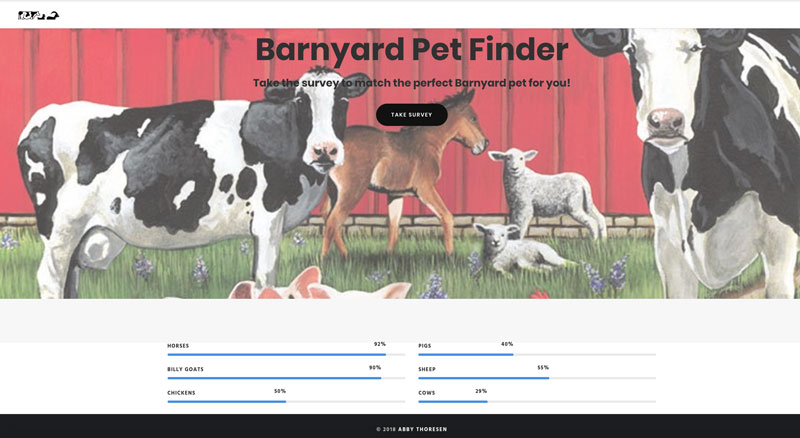
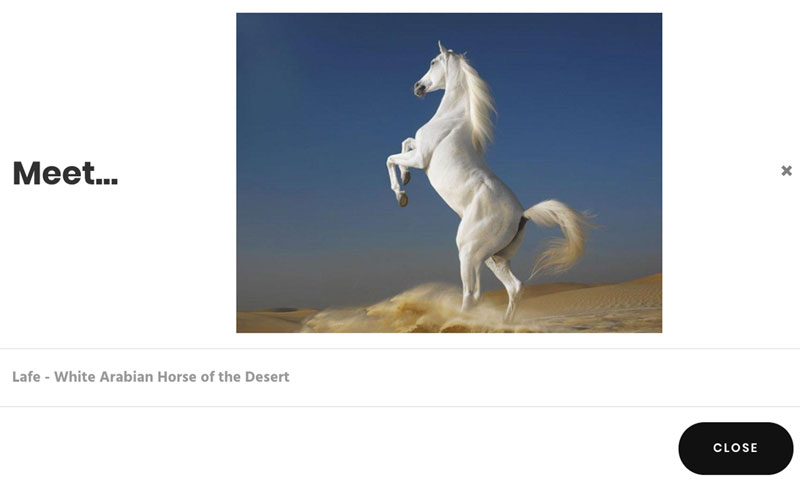
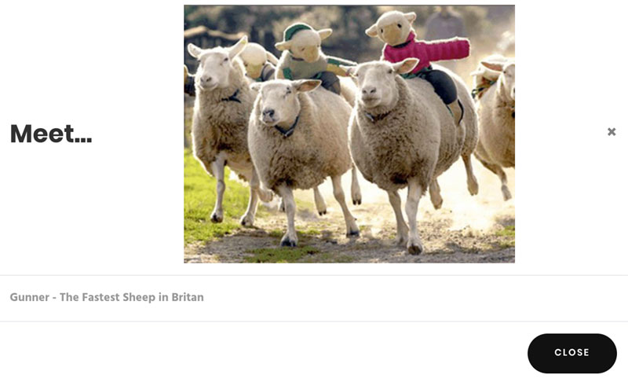

# Barnyard Pet Friend Finder - Node and Express Servers

## Overview
I built a compatibility-based "Barnyard Pet Friend Finder" full stack application. This full-stack site takes in results from the users' surveys, then compare their answers with those from my API Friends List. The app then displays the name and picture of the animal with the best overall match.

## Home Page

## Modal Pop Up's

## See it online at:
https://evening-sierra-16412.herokuapp.com/home.html

## Technologies Used:
Express
JQuery
JavaScript
nodeJS
npm packages: express, body-parser

## Author
Abby Thoresen copyright 2018
